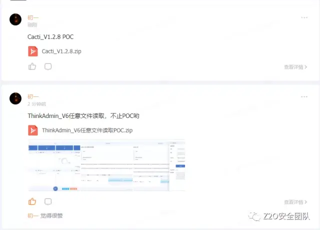

## ctfr 收集子域名

Ctfr modified for komo https://github.com/komomon/Komo Komo, a comprehensive asset collection and vulnerability scanning tool.

ctfr修改版，适用于komo https://github.com/komomon/Komo Komo 一个综合资产收集和漏洞扫描工具，集成了20余款工具，通过多种方式对子域进行获取，收集域名邮箱，进行存活探测，域名指纹识别，域名反查ip，ip端口扫描，web服务链接爬取并发送给xray，对web服务进行POC漏洞扫描，对主机进行主机漏洞扫描。

## 一起交流

感兴趣的可以关注 **Z2O安全攻防** 公众号回复“**加群**”，添加Z2OBot 小K自动拉你加入**Z2O安全攻防交流群**分享更多好东西。

团队建立了知识星球，不定时更新最新漏洞复现，手把手教你，同时不定时更新POC、内外网渗透测试骚操作。感兴趣的可以加一下。

**欢迎star:star: O(∩_∩)O**

